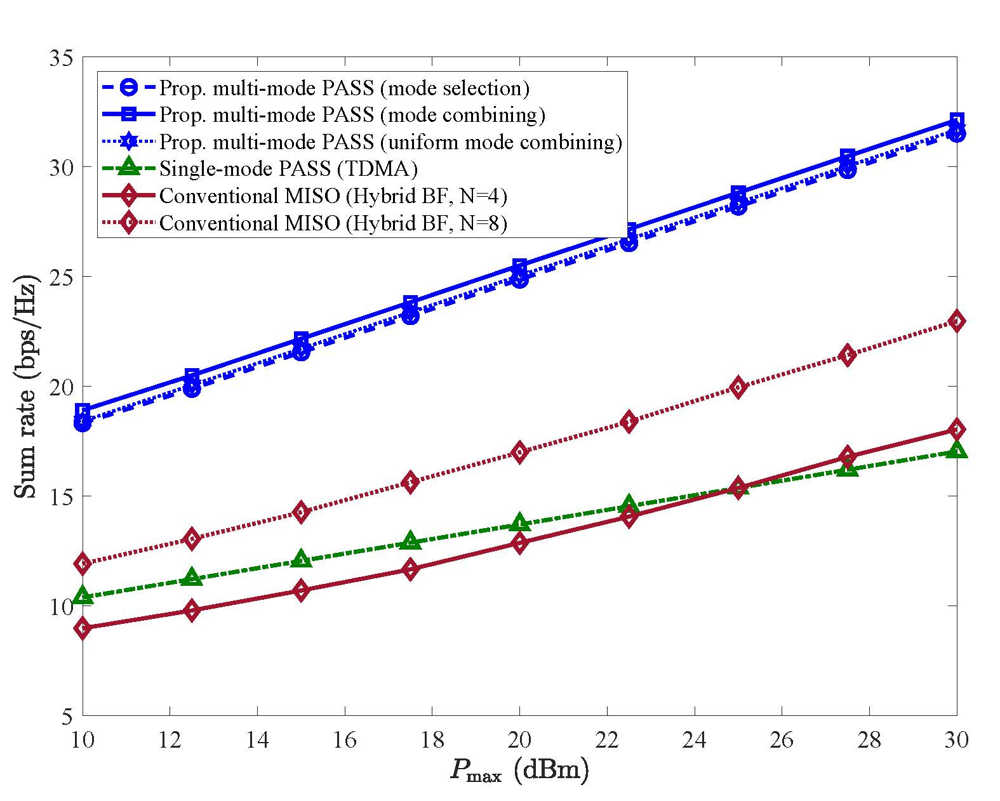
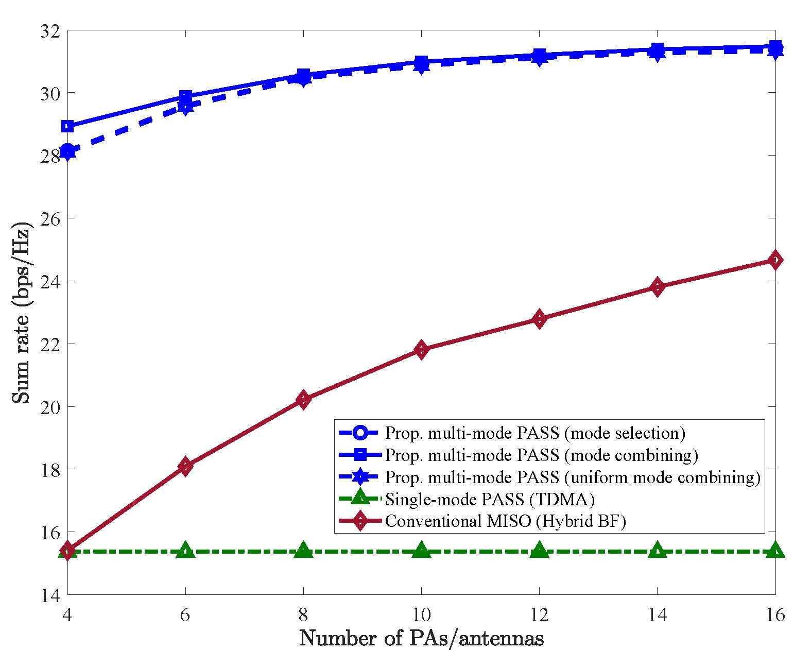

# Multi-Mode Pinching Antenna Systems: Mode Selection or Mode Combining? 

This repository provides the MATLAB implementation of multi-mode pinching-antenna systems (PASS) and reproduces the simulation results in paper **Multi-Mode Pinching-Antenna Systems: Mode Selection or Mode Combining?** 
[[arXiv Preprint](https://arxiv.org/abs/2603.08472)] 

## ✨ Key Idea

### Concept of Multi-Mode Pinching-Antenna Systems

PASS place pinching antennas (PAs) along a low-loss dielectric waveguide to radiate signals close to users, thereby significantly shortening propagation distance, reducing large-scale path loss, as well as altering signal phases. 

**Multi-mode PASS** 
- Allows a single waveguide to excite **multiple electromagnetic modes**. Then, signals of multiple independent data streams can be propagated within one waveguide and radiated by PAs to simultaneously serve multiple users. 
- Enables **mode-domain multiplexing** and offers extra **degrees of freedom (DoFs)**.
- Compared to conventional single-mode PASS, where each waveguide can support only a *single* independent data stream, spectral efficiency and resource utilization can be significantly improved.

### This paper proposes:
**1.** Two **operating protocols** for multi-mode PASS, which leads to different electromagnetic coupling behaviours.
- **Mode Selection**: 
Each PA predominantly radiates power of a single guided mode by performing phase matching with this selected mode to maximize the coupling strength.
By doing so, the propagation constant $\beta_{n}^{\mathrm{PA}}$ of PA $n$ must be selected from a discrete set $\\{\beta_{1},\beta_{2},\ldots,\beta_{M}\\}$ of the propagation constants of guided modes $m=1,2,\ldots,M$.
- **Mode Combining**: 
Each PA can flexbily radiate power of multiple modes without phase matching to a specific mode, thereby fully exploiting mode-domain multiplexing.
This is achieved by continuously tuning $\beta_{n}^{\mathrm{PA}}$ of PA $n$ within range $[\beta_{\min},\beta_{\max}]$.

> **Uniform Mode Combining**: A practical operating protocol is uniform mode combining,
> where the propagation constant of each PA can be preconfigued at $\beta=(\beta_{1}+\beta_{2}+...\beta_{M})/M$. Our simulation results demonstrate the efficiency of this design.

**2.** A **Particle Swarm Optimization with KKT Parameterized Beamforming (PSO-KPBF)** algorithm, which jointly optimizes digital beamforming, pinching locations, and PA propagation constants for sum rate maximization.
> PSO searches for desirable KPBF dual parameters, pinching locations, and propagation constants of PAs. For each PSO particle, **KPBF** reconstructs KKT-conditioned beamforming from the dual prameters for fast fitness evaluation. 
> It has following **benefits**:
>- Reconstructing stationary beamforming solutions without WMMSE iterations in a low-complexity way.
>- Guiding black-box swarm search by KKT solutions, significantly reducing the searching space. 

## 🚀 Reproducing Guideline

The repository includes scripts to reproduce the main numerical results from the paper.

### Reproduce Fig. 2 - Achievable Rate vs. Maximum Transmit Power

Simply run [M_PASS_PSO_KPBF_Pmax.m](./M_PASS_PSO_KPBF_Pmax.m) you will get 

  

### Reproduce Fig. 3 - Achievable Rate vs. Number of PAs/Antennas

Simply run [M_PASS_PSO_KPBF_vs_N.m](./M_PASS_PSO_KPBF_vs_N.m) you will get

  

## ❤️ Citation
If you find this work useful for your research, please consider citing: 

X. Xu, X. Mu, Y. Liu, and A. Nallanathan,
“Multi-Mode Pinching-Antenna Systems: Mode Selection or Mode Combining?”
arXiv:2603.08472, 2026.

## 📄 Related Work
The fundamental concept and detailed physic model of multi-mode PASS can be found in paper ``Multi-Mode Pinching Antenna Systems Enabled Multi-User Communications'' [[arXiv Preprint](https://arxiv.org/abs/2601.20780)]. In this previous work, the PAs are divided into two groups for fixed mode selection. 
